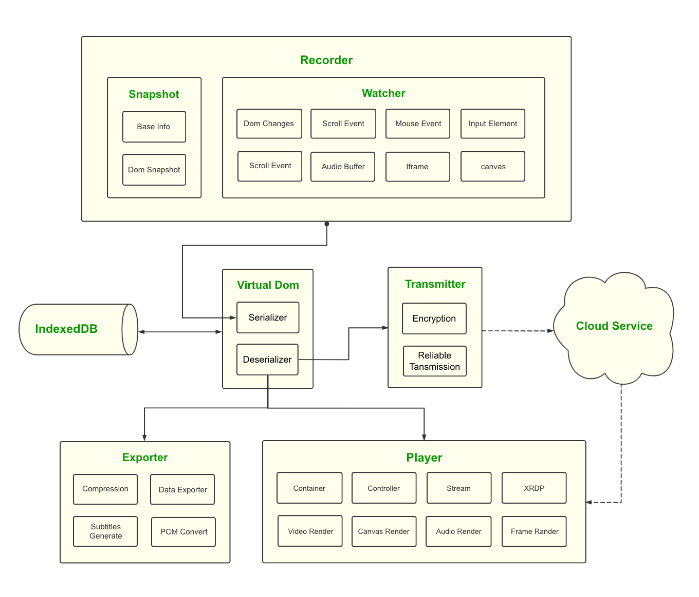
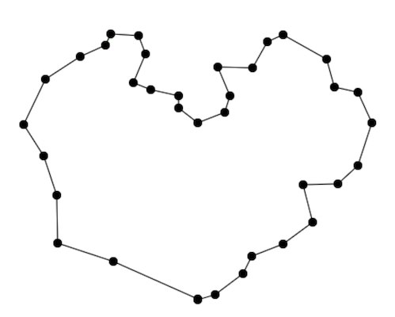
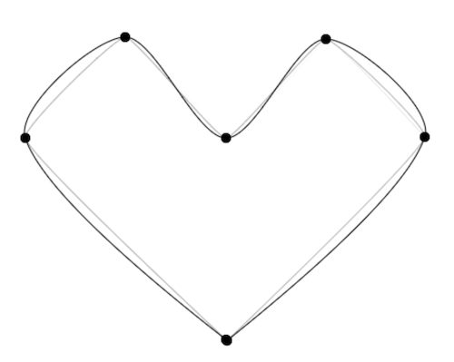
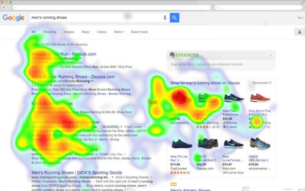

<p align="center">
<h1 align="center">TimeCat</h1>
<h6 align="center">
A Magical Web Recorder 🖥 网页录屏器
</h6>
<h6 align="center">

  

<h6>

### 项目简介

中文 | [English](./README.md)

TimeCat 是一套网页录屏的解决方案，利用其独特的算法，提供超高性能，超高压缩比的网页无损录制。可以广泛运作于监控系统，行为分析，案例复盘，远程教育，低流量视频协同等场景

[🖥 DEMO](https://oct16.github.io/TimeCat) Chrome浏览器

### Progress
    06.07 Support Audio
    05.24 Beta 1.0.0 Released
    04.26 Live Mode    
    03.31 Add Chrome Plugin 

### Version 


###### Browsers Support

| [](http://godban.github.io/browsers-support-badges/)<br/>Edge | [](http://godban.github.io/browsers-support-badges/)<br/>Firefox | [](http://godban.github.io/browsers-support-badges/)<br/>Chrome | [](http://godban.github.io/browsers-support-badges/)<br/>Safari |
| ----------------------------------------------------------------------------------------------------------------------------------------------------------------------------------------------------- | ----------------------------------------------------------------------------------------------------------------------------------------------------------------------------------------------------------------- | ------------------------------------------------------------------------------------------------------------------------------------------------------------------------------------------------------------- | ------------------------------------------------------------------------------------------------------------------------------------------------------------------------------------------------------------- |

### Installation

###### Using [NPM](https://www.npmjs.com/package/timecatjs)
```shell
$ npm i timecatjs -D
```

###### Import in Browser

Add script tags in your browser and use the global variable ``timecat``


- [jsDelivr](https://cdn.jsdelivr.net/npm/timecatjs@latest/lib/timecatjs.min.js) 
- [UNPKG](https://unpkg.com/timecatjs)

### Usage

###### Import SDK
```ts
// from module
import { record, replay } from 'timecatjs';

// from cdn
const { record, replay } = window.timecat
```

###### Record Data
```ts
// record page
interface RecordOptions {
    audio?: boolean // if your want record audio
    emitter?: (data: RecordData, db: IndexedDBOperator) => void
}

// default use IndexedDB to save records
const ctrl = record(RecordOptions)

// if you wanna send the records to server
const ctrl = record({
    emitter: (data, db) => fetch(<Server URL>, {
            body: JSON.stringify(data),
            method: 'POST',
            ContentType: 'application/json'
        })
})

// if you want stop record
ctrl.unsubscribe()
```
- [Record Example](https://github.com/oct16/TimeCat/blob/073c467afc644ce37e4f51937c28eb5000b2a92c/examples/todo.html#L258) 

###### Replay

```ts
// replay record
interface ReplayOptions {
    socketUrl?: string // if live mode
    proxy?: string // if cross domain
    autoplay?: boolean // autoplay when data loaded
}

replay(ReplayOptions)
```
- [Replay example](https://github.com/oct16/TimeCat/blob/4c91fe2e9dc3786921cd23288e26b421f6ea0848/examples/player.html#L14)


###### Export
```ts
// export html file
interface ExportOptions {
    scripts?: ScriptItem[] // inject script in html
    autoplay?: boolean // autoplay when data loaded
    audioExternal?: boolean // export audio as a file, default is inline
    dataExternal?: boolean // export data json as a file, default is inline
}
exportReplay(ExportOptions)
```

### API Documentation

[TYPEDOC](https://oct16.github.io/TimeCat/docs/globals.html)

### TimeCat -- 不可思议的Web录屏器

如果你爱打游戏，一定打过魔兽争霸3（暴露年纪🤣），你也许会游戏导出的录像文件感到好奇，明明打了一个小时游戏，为什么录像才几百KB而已。不过很快你又发现另一个问题，在每次导入录像的时候需要重新加载一次地图，否则就不能播放。


录像记录的数据不是一个视频文件，而是带着时间戳的一系列动作，导入地图的时候，实际相当于初始了一个状态，在这个状态的基础上，只需要对之前的动作进行还原，也就还原了之前的游戏过程，这就是repl的基本原理了

> 相关问题：[《魔兽争霸》的录像，为什么长达半小时的录像大小只有几百 KB？](https://www.zhihu.com/question/25431134)


但是这样有什么好处呢？

首先是对于一个录像，这样的方式极大程度的减小了体积，假设我们需要录一个小时的1080p24f视频，在视频未压缩的情况下
```
总帧数 = 3600s * 24 = 86400frame

假设每个逻辑像素用RGB三基色表示，每个基色8bits(256色)   
帧大小 = (1920 * 1080)pixels * 8bits * 3 = 49766400bits

换算成KB是 49766400bits / 8 / 1024 = 6075KB

总视频体积 = 6075KB * 86400 = 524880000KB ≈ 500GB
```

所以对比传统的视频录像方法，假设录像是500KB，那么理论上体积上缩小了大约 524880000KB / 500KB ≈ 1000000倍

Web录屏器其实也借鉴这样的一种思路，工程上一般称之为Operations Log, 本质上他的实现也是通过记录一系列的浏览器事件数据，利用浏览器引擎重新渲染，还原了之前的操作过程，也就达到了“录屏器”的效果

从实际来看，即使对比采用H.265压缩比达到几百倍的压缩视频，体积上至少也能节省200倍以上

对比传统的视频流，它的优势也是显而易见的

    1. 极大程度减小录像文件体积
    2. 极低的CPU与内存占用比率
    3. 无损显示，可以进行无极缩放，窗口自适应等
    4. 非常灵活的时间跳转，几乎无法感知的缓冲时间
    5. 所有信息都是活的，文本图片可以复制，链接可以点击，鼠标可以滚动
    6. 可以方便的录制声音，并让声音和画面同步，还以类似YouTube那样把声音翻译成字幕
    7. 方便进行视频细节的修改，例如显示的内容进行脱敏，生成热力图等
    8. 记录的序列化数据，十分利于知乎进行数据分析   
        ...


那么问题来了：为什么要对网页录像？有哪些应用场景？

我能想到的主要有以下几个方面

1. 异常监控系统，例如[LogRocket](https://logrocket.com/)，可以理解他是一个整合了Sentry + 录屏器的工具，能回放网页错误时的图形界面与数据日志，从而帮助Debug
2. 记录用户的行为进行分析，例如[MouseFlow](https://mouseflow.com/)。甚至还可以是直播的方式[LiveSession](https://livesession.io/)，“连接”到用户的浏览中，看看用户是怎么使用网站的
3. 对客服人员的监控，例如阿里的有十万级别的客服小二人员分散在全国各地，需要对他们的服务过程进行7x24小时的录屏，在这个数量级上的对监控的性能要求就非常高了，阿里内部的工具叫`XReplay`
4. 协同工具，Web直播等，也会涉及类似的技术

....

---
### Web录屏器的技术细节



#### 对DOM进行快照

通过DOM的API可以很轻易的拿到页面的节点数据，但是对于我们的需求而言，显而DOM Node提供的数据太冗余了，这一步通过参考VirtualDom的设计，把信息精简一下

```ts
interface VNode {
    type: number
    id: number
    tag: string
    attrs: Attrs
    children: VNode[]
    extra: Extra
}
```

对DOM进行深度遍历后，DOM被映射成了VNode类型节点，需要记录的 Node 主要是三种类型 `ELEMENT_NODE`，`COMMENT_NODE`和 `TEXT_NODE`，之后在播放时，只需要对VNode进行解析，就可以还原成记录时的状态了

在这过程中，有一些节点和属性需要特殊处理，例如

- `InputElement`等类型的`value` `checked`是无法从DOM获取的，需要从节点中对象中获取
- `script`标签的内容由于之后不会去执行，所以可以直接`skip`或者标记为`noscript`
- `SVG`可以直接获取，但是它本身以及它的子元素重新转换为DOM的时候需要使用`createElementNS("http://www.w3.org/2000/svg", tagName)`的方法创建元素
- `src`或`href`属性如果是相对路径，需要把他们转换为绝对路径
  ......

#### 记录影响页面元素变化的Action

DOM的变化可以使用`MutationObserver`, 监听到`attributes`,`characterData`,`childList` 三种类型的变化
```ts
const observer = new MutationObserver((mutationRecords, observer) => {
    // Record the data
})
observer.observe(target, options)
```

再借助`WindowEventHandlers` `addEventListener` 等的能力组合，就可以监听到页面一系列的操作事件了
- Add Node Action
- Delete Node Action
- Change Attribute Action
- Scroll Action
- Change Location Action
...

通过 `mouseMove` 和 `click` 事件记录鼠标动作 

对于 `mouseMove` 事件，在移动的过程中会频繁的触发，产生很容冗余的数据，这样的数据会浪费很多的空间，因此对于鼠标的轨迹，我们只采集少量的关键点，最简单的办法是使用节流来减小事件产生的数据量，但是也有一些缺点： 

- 截流的间隔中可能会丢失关键的鼠标坐标数据   
- 即时通过截流在移动距离足够长的时候任然会产生巨大的数据量，更好的办法是通过 `Spline Curves(样条曲线)` 函数来计算得出移动轨迹、抖动、加速度等生成一条路径曲线用来控制鼠标的移动   

Input的变换我们可以通过`Node.addEventListener` 的 `input` `blur` `focus` 事件监听，不过这只能监听到用户的行为，如果是通过JavaScript对标签进行赋值，我们是监听不到数据的变化的，这时我们可以通过`Object.defineProperty`来对一些表单对象的特殊属性进行劫持，在不影响目标赋值的情况下，把value新值转发到自定的handle上，统一处理状态变化

```ts
const elementList: [HTMLElement, string][] = [
        [HTMLInputElement.prototype, 'value'],
        [HTMLInputElement.prototype, 'checked'],
        [HTMLSelectElement.prototype, 'value'],
        [HTMLTextAreaElement.prototype, 'value']
    ]

    elementList.forEach(item => {
        const [target, key] = item
        const original = Object.getOwnPropertyDescriptor(target, key)
        Object.defineProperty(target, key, {
            set: function(value: string | boolean) {
                setTimeout(() => {
                    handleEvent.call(this, key, value)
                })
                if (original && original.set) {
                    original.set.call(this, value)
                }
            }
        })
    })
```
#### MutationObserver

###### 优化改进

由于 DOM 的 Diff Patch 是借助 MutationObserver 来实现的，需要对发生更变的记录进行收集处理，这涉及到一些关键问题：例如DOM更变的时序是有先后的，Mutation只归纳为新增和删除，但是在调用insertBefore或者appendChild的时候，会造成移动，要对这些节点进行处理，标记为移动，否则节点的引用丢失就可能会导致渲染错误


###### 兼容性处理

[Can I Use MutationObserver](https://caniuse.com/#search=mutationObserver) 表示只在IE11及以上，安卓4.4及以上可以使用，对于老浏览器的兼容可以通过[mutationobserver-shim](https://www.npmjs.com/package/mutationobserver-shim)的方式来支持，但是使用shim可能会因为收集的数据致精度不足从而产生一些致命Bug，另外还有一种情况是某些网站可能会屏蔽的掉MutationObserver这个API，遇到这种清空可以通过创建Iframe的方式来还原``Native Code``

#### Canvas、Iframe、Video等元素的处理

- Canvas：通过猴子补丁的方式去扩展或修改相应的API，从而获取到对应的动作
- Iframe：在非跨域的状态下，也可以直接访问内部的节点进行录制，类似的还有Shadow Dom
- Video：利用HTMLVideoElement获取并且记录视频的状态信息
- Flash：通过截屏的方式进行录制

#### 外链的处理

加载HTML以后会引用很多外界的资源，通常会有多种形式

例如：
- 绝对路径 ```` 
- 相对路径 ```` 
- 相对当前path的路径 ```` 
- 协议相对URL (The Protocol-relative URL)````
- srcset响应式图片 [Responsive images](https://developer.mozilla.org/en-US/docs/Learn/HTML/Multimedia_and_embedding/Responsive_images) ``src="www.xxx.png" srcset="www.xxx.png 1x, www.xxx.png 2x"``   
...

以上就需要一个转换器来处理路径问题，在``Deserialize``阶段，把他们转成原域名下的绝对路径才能在跨域下正常加载
还有一种情况是对于第三方资源加载第三方资源的问题，这就需要借助服务器来解决了

###### CORS Error 问题

通常是由于被录制的网站对资源进行了限制, 开启了CORS Policy，解决方案是，如果资源可控，可以添加白名单或者忽略，另外就是使用代理服务器， 
> 参考文章：[3 Ways to Fix the CORS Error](https://medium.com/@dtkatz/3-ways-to-fix-the-cors-error-and-how-access-control-allow-origin-works-d97d55946d9)


#### SPA网页的渲染时间

在开始播放前，我们需要把之前的存储的数据还原成真实的DOM，这个过程中会占用一定的加载时间产生白屏，这取决于你的浏览器性能以及录制网页资源情况，参考FMP（First Meaningful Paint）的实现，加载过程中可以通过之前映射的数据动态生成骨架图，等待FMP发出Ready信号之后再进行播放

> 参考文章： [Time to First Meaningful Paint](https://docs.google.com/document/d/1BR94tJdZLsin5poeet0XoTW60M0SjvOJQttKT-JK8HI/view#)

#### 通过样条曲线模拟鼠标轨迹

用户在网页中移动鼠标会产生很多`mouseMove`事件，通过 `const { x, y } = event.target` 获取到了轨迹的坐标与时间戳

假如我在页面上用鼠标划过一个💖的轨迹，可能会得到下图这样的坐标点


但是对于录屏这个业务场景来说，大部分场合我们并不要求100%还原精确的鼠标轨迹，我门只会关心两种情况：

    1. 鼠标在哪里点击?
    2. 鼠标在哪里停留?

那么通过这个两个策略对鼠标轨迹进行精简后，画一个💖大约只需要6个点，通过样条曲线来模拟鼠标的虚拟轨迹，当 t = 0.2 的时候，就可以得到一个下图这样带着弧度的轨迹了



通过规则筛选出关键点后，利用B样条曲线计算函数，按照最小间隔进行取样并插入我们的鼠标路径队执行列里，当渲染时重绘鼠标位置的时候，就可以得到一个近似曲线的鼠标轨迹了

#### 通过Diff字符串优化数据长度

当我们在一个输入框中不断的敲击内容时，我们的Watcher函数会源源不断的事件响应，通过`Event.target.value`可以拿到当前`HTMLInputElement`最新的值，利用节流函数可以过滤掉一些冗余的响应，但是还不够，例如在一个TextArea中的文本会非常的长长长长长，假设文本的长度是n，我们在文本后面添加了10个字符，每次输入响应1次，那么响应的长度是：
> 10n + ∑(k=1, n=10)

可见会产生大量的数据

通过 Diff Patch 之后，把字符串`abcd` 修改 `bcde`可以表达为：

> <h3><del>a</del>bcd<ins>e</ins></h3>

```ts
const patches = [
    { type: 'delete', index: 0, count: 1 },
    { type: 'add', index: 3, value: 'e' }
]
```

#### 通过鼠标数据生成热力图

之前已经通过鼠标事件记录了完整的坐标信息，通过[heatmap.js](https://www.patrick-wied.at/static/heatmapjs/)可以很方便的生成热力图，用于对用户的行为数据进行分析。

这里需要注意的地方是当页面切换的时候我们需要重置热力图，如果是单页应用，通过 `History` 的 `popstate` 与 `hashchange` 可以监听页面的变化



#### 对于用户隐私的脱敏

对于一些客户个人隐私数据，通过在开发时对DOM进行标注的 `Node.COMMENT_NODE`（例如： `<!-- ... -->`）信息申明，我们是可以获取并加工的。通过约定好的声明对需要脱敏的DOM块按业务的需求进行处理即可，例如在项目的DEMO中，我需要在回放的时候把```<button>```标签隐藏掉，只需改写成```<!--hidden--><button>```

#### 沙箱化提升安全

录制的内容有可能属于第三方提供，这意味着可能存在一定的风险，网站中可能有一些恶意的脚本并没有被我们完全过滤掉，例如：`<div onload="alert('something'); script..."></div>`，或者我们的播放器中的一些事件也可能对播放内容产生影响，这时候我们需要一个沙盒来隔离播放内容的环境，HTML5 提供的 `Sandbox` 是不错的选择，这可以帮助我们轻易的隔离环境：
- script脚本不能执行
- 不能发送ajax请求
- 不能使用本地存储，即localStorage,cookie等
- 不能创建新的弹窗和window, 比如window.open or target="_blank"
- 不能发送表单
- 不能加载额外插件比如flash等
- 不能执行自动播放的tricky. 比如: autofocused, autoplay

#### 播放、跳转与快进

##### 播放
播放器会内置一个精确的计时器，动作的数据存储在一个栈中，栈中的每一个对象就是一帧，通过`RAF(RequestAnimationFrame)`对数据帧的时间戳进行扫描从而得知下一帧在什么时间发生

##### 暂停
通过`CancelAnimationFrame`暂停计时器

##### 快进
加速渲染帧的速率

##### 双向跳转
跳转是个复杂的问题，如果要实现像视频那样可以向前与向后的双向跳转，由于受到渲染引擎的约束，我并没有实现出一个反向渲染的方法，而是通过特殊的办法来解决
>参考文章：[为什么大多数游戏的回放功能都不能倒放或者跳跃进度？](https://www.zhihu.com/question/309668627)

要实现双向跳转，这里的思路是在内存中按照一定的距离计算出相应的 `S (Snapshot)` 与 `A (Action)`

| _S_ | `A` | `A` | `A` | _S_ | `A` | `A` | _S_ | `A` | `A` | `A` | ...... |
| --- | --- | --- | --- | --- | --- | --- | --- | --- | --- | --- | ------ |

于是`[SAAA]`形成了一个区块，发生跳转行为时，会定位到相应的区块中进行计算后并渲染

#### 录制音频与生成字幕

通过HTML5提供的`WebRTC`接口可以进行音频录制，由于主要是录制人声语音，所以对于录制品质要求并不高，这里我选用了8000的采样率和8比特率单声道的PCM录制格式，后期可以转化为有损压缩的`mp3`格式以节省空间，字幕会通过一些第三方服务分析录制文件后自动生成

#### 在客户端进行的Gzip压缩

Gzip一般是在网络应用层里对传输数据进行压缩，但是我们的数据不一定只存在数据库里，可能会有三种储存方式

- 服务器存储 TCP => DB
- 本地储存 LocalStorage、IndexedDB、Web SQL
- 数据持久化于script中，保存为本地文件，例如直接导出可运行的HTML文件

利用客户端的运算能力，在进行导出或者传输之前，可以对数据进行压缩，极大程度的减小体积

在客户端可以进行基于 `Gzip` 的数据包压缩，这里我选择了 [Pako](https://nodeca.github.io/pako/) 来对数据进行压缩   
Gzip的核心是Deflate, 而Deflate又是基于LZ77和哈夫曼树的，通过Gzip把文本数据转换成`Uint8Array`, 再把`Uint8`转成对应的`ASCII`，这样的好处是每一个编码只会占用`1byte`的空间，通过压缩减少约`5`倍左右的体积

#### 数据上传

对于客户端的数据，可以利用浏览器提供的indexedDB进行存储，毕竟indexedDB会比LocalStorage容量大得多，一般来说不少于 250MB，甚至没有上限，此外它使用object store存储，而且支持transaction，另外很重要的一点它是异步的，意味着不会阻塞录屏器的运行，之后数据可以通过WebSocket或http方式持续上传到服务器中，由于数据是分块进行传输的，在同步之后还可以增加数据校验码来保证一致性避免错误

#### 加载SDK

通过RollUp打包器可以生成多种格式版本，例如``UMD``与``ESM``等
在项目中加载SDK或者利用Chrome的插件注入UMD模块，可以很方便的加载代码，控制数据录制的过程

#### 致谢

感谢阿里的XREPLAY的启发   
感谢RRWEB的技术分享   

#### 寻求工作机会

如有伯乐
若不介意学历因素
请与我联系：

微信：
```js
62809912 >> 2
```
邮箱：见Github个人主页
职位：前端工程师
方向：应用工具/大型网站
地点：天南海北
